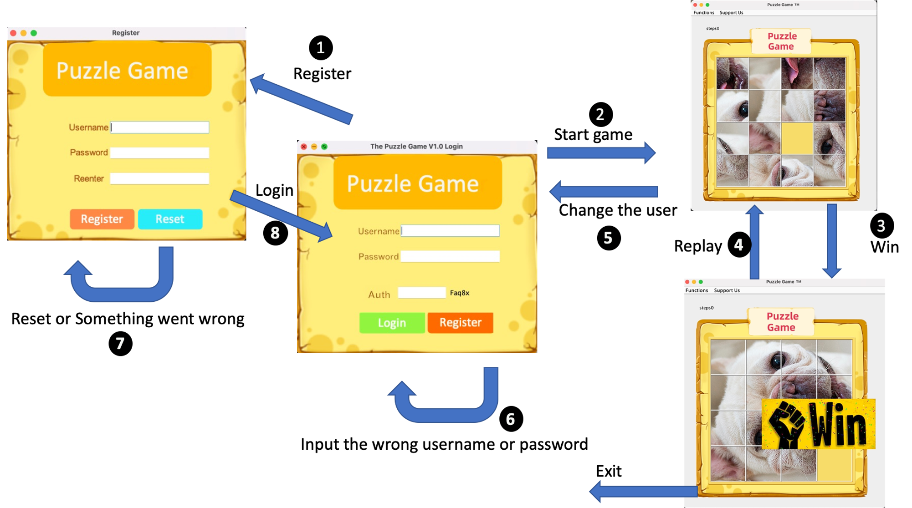

## A Graph-Based Sliding Block Puzzle Game

The sliding puzzle is a combination puzzle that challenges a player to slide pieces along certain routes to establish a certain end configuration. The pieces to be moved may consist of simple shapes, or they may be imprinted with colors, patterns, and sections of a larger picture. 

### To start the game

go to src and run the App.java then the game will start
